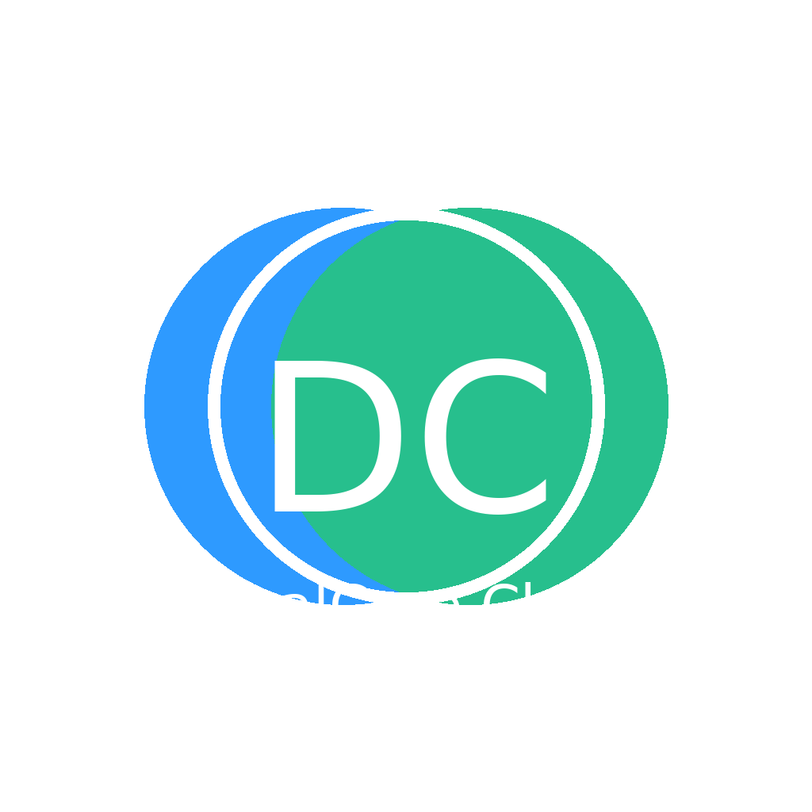

# DualCore Chat — Privacy-first multi-AI desktop client

  

## 🚀 Overview
DualCore Chat is a **desktop client for multiple AI models**, built with **Tauri + React + Rust**.  
- Local-only conversation history (**no server, fully private**).  
- Switch easily between **OpenAI, Gemini, Claude, Grok, Ollama (local)**.  
- Lightweight: powered by **Tauri** (tiny footprint vs Electron).  
- **Signed builds + auto-update pipeline**.  

## 📸 Screenshots

   
  <em>Chat interface</em>

   
  <em>Model settings page</em>

   
  <em>Memory & history view</em>

## 💾 Download
👉 [Download Latest Release](https://github.com/adamli0526-rgb/Dualcore-Chat)

Available for **Windows (.msi/.exe)**, **macOS (.dmg)**, and **Linux (.AppImage)**.  

## 💳 License & Pricing
- **Trial:** 7 days free  
- **Full license:** $9.99 (one-time purchase)  
- Purchase via [Lemon Squeezy](https://dualcore-chat.lemonsqueezy.com/checkout)  

After purchase, enter your license code inside the app under *Settings → License & Trial*.  

## 🔒 Privacy
- Your chat history is stored **locally on your computer**.  
- No data is uploaded to our servers.  
- Requests go directly to the AI providers you configure.  

## ⚙️ Tech Stack
- Tauri (Rust backend)  
- React + TypeScript (frontend)  
- Cross-platform builds with auto-updater  

## 📢 Feedback
We welcome feedback and suggestions!  
- [Issues](../../issues) → Bug reports  
- [Discussions](../../discussions) → Ideas & feature requests  

---
